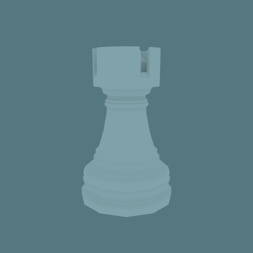
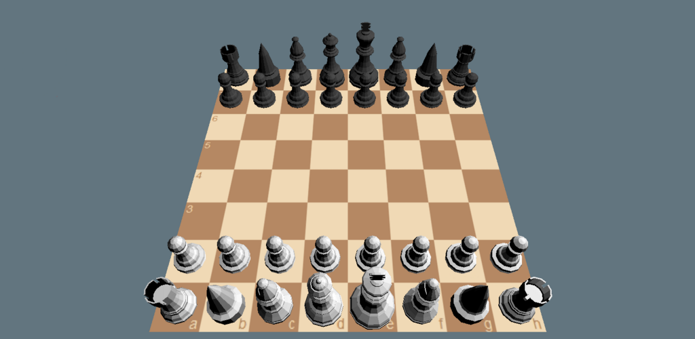
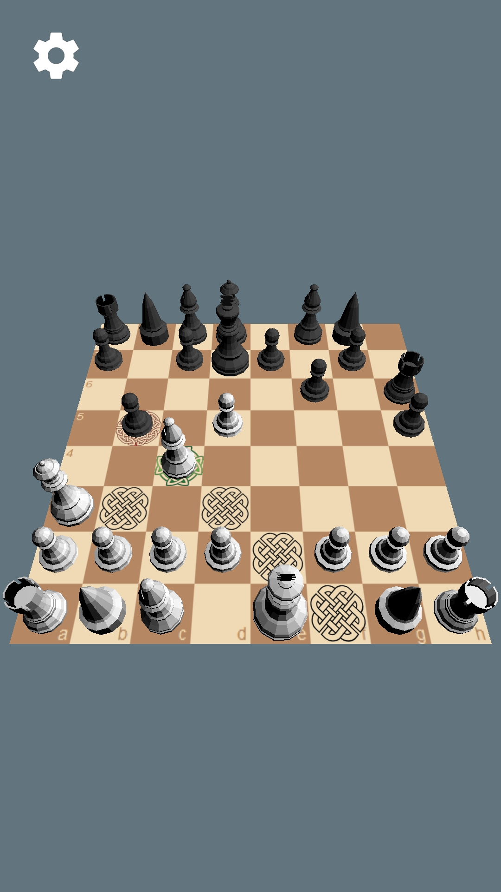
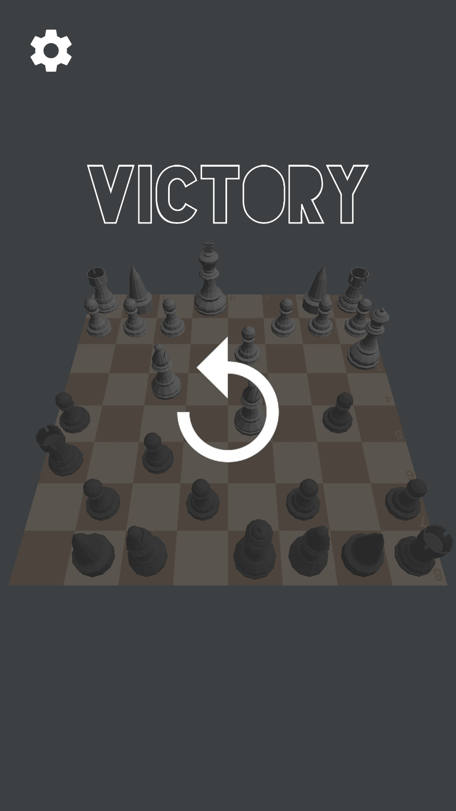

# Chess

    

A chess game made with my own game engine

 Google Play: https://play.google.com/store/apps/details?id=antonforsberg.chess

<table>
  <tr>
    <td>
         
    </td>
    <td>
        
    </td>
  </tr>
</table>

